# MultiAgent Implementation Dependency Analysis

**Generated**: 2025-01-28
**Location**: packages/haive-agents/src/haive/agents/multi/

## Timeline and File Modification Dates

All files show the same modification date: **Jul 25 18:35** (likely from a bulk update or git operation)

## File Analysis

### 1. **multi_agent.py** (9,693 bytes)
- **Base Class**: `Agent` (from `haive.agents.base`)
- **Core Dependencies**:
  - `haive.core.engine.aug_llm.AugLLMConfig`
  - `haive.core.graph.node.agent_node_v3.AgentNodeV3Config`
  - `haive.core.graph.state_graph.base_graph2.BaseGraph`
  - `langgraph.graph` (END, START)
- **Key Features**: Clean implementation with 3 execution modes (sequence/parallel/conditional)
- **Inter-MultiAgent Deps**: None

### 2. **multi_agent_v4.py** (11,204 bytes)
- **Base Class**: `Agent` (from `haive.agents.base.agent`)
- **Core Dependencies**:
  - `haive.core.graph.node.agent_node_v3.create_agent_node_v3`
  - `haive.core.schema.prebuilt.multi_agent_state.MultiAgentState`
  - `langgraph.graph` (END, START, StateGraph, CompiledGraph)
- **Key Features**: V4 pattern with enhanced base agent, MultiAgentState usage
- **Inter-MultiAgent Deps**: None

### 3. **clean.py** (24,666 bytes) ⭐ **PRIMARY EXPORT**
- **Base Class**: `Agent` (from `haive.agents.base.agent`)
- **Core Dependencies**:
  - `haive.core.graph.state_graph.base_graph2.BaseGraph`
  - `haive.core.schema.prebuilt.multi_agent_state.MultiAgentState`
- **Key Features**: Unified implementation, list initialization, auto-detection of routing mode
- **Inter-MultiAgent Deps**: None
- **Note**: This is what's exported from `__init__.py`

### 4. **enhanced_multi_agent_v3.py** (39,445 bytes) - Largest file
- **Base Class**: `Agent` (from `haive.agents.base.enhanced_agent`), Generic[AgentsT]
- **Core Dependencies**:
  - `haive.core.engine.aug_llm.AugLLMConfig`
  - `haive.core.graph.node.agent_node_v3.AgentNodeV3Config`
  - `haive.core.graph.state_graph.base_graph2.BaseGraph`
  - `haive.core.schema.prebuilt.enhanced_multi_agent_state.EnhancedMultiAgentState`
  - `haive.core.schema.prebuilt.multi_agent_state.MultiAgentState`
- **Key Features**: Generic typing, performance tracking, multi-engine coordination
- **Inter-MultiAgent Deps**: None

### 5. **enhanced_multi_agent_v4.py** (26,518 bytes)
- **Base Class**: `Agent` (from `haive.agents.base.enhanced_agent`)
- **Core Dependencies**:
  - `haive.core.graph.node.agent_node_v3.create_agent_node_v3`
  - `haive.core.graph.state_graph.base_graph2.BaseGraph`
  - `haive.core.schema.prebuilt.multi_agent_state.MultiAgentState`
  - `langgraph.graph` (END, START)
- **Key Features**: V4 pattern, dynamic graph building, hot agent addition
- **Inter-MultiAgent Deps**: None

### 6. **enhanced_multi_agent_generic.py** (12,282 bytes)
- **Base Class**: Uses alias `EnhancedAgentBase` from `haive.agents.simple.enhanced_simple_real`
- **Core Dependencies**:
  - `haive.core.graph.node.agent_node_v3.AgentNodeV3Config`
  - `haive.core.graph.node.engine_node.EngineNodeConfig`
  - `haive.core.graph.state_graph.base_graph2.BaseGraph`
- **Key Features**: Generic typing system, defines BranchingMultiAgent, ConditionalMultiAgent
- **Inter-MultiAgent Deps**: None
- **Note**: Avoids standard agent imports to prevent issues

### 7. **enhanced_multi_agent_standalone.py** (20,088 bytes)
- **Base Class**: Defines its own base classes to avoid imports
- **Core Dependencies**: Minimal - just stdlib and Pydantic
- **Key Features**: Completely standalone, demonstrates patterns without dependencies
- **Inter-MultiAgent Deps**: None
- **Note**: Educational/demonstration file

## Dependency Graph

```
haive.core modules
├── engine.aug_llm (AugLLMConfig)
├── graph.node.agent_node_v3 (AgentNodeV3Config, create_agent_node_v3)
├── graph.node.engine_node (EngineNodeConfig)
├── graph.state_graph.base_graph2 (BaseGraph)
├── schema.prebuilt.multi_agent_state (MultiAgentState)
└── schema.prebuilt.enhanced_multi_agent_state (EnhancedMultiAgentState)

haive.agents.base modules
├── Agent (used by: multi_agent.py, clean.py)
├── base.agent.Agent (used by: multi_agent_v4.py)
└── base.enhanced_agent.Agent (used by: enhanced_v3, enhanced_v4)

Special cases:
└── enhanced_multi_agent_generic.py → uses haive.agents.simple.enhanced_simple_real
└── enhanced_multi_agent_standalone.py → no haive imports (self-contained)
```

## Key Findings

### 1. **No Circular Dependencies**
- None of the MultiAgent files import from each other
- All inherit from base Agent classes, not from other MultiAgent implementations

### 2. **Multiple Base Agent Classes**
- `haive.agents.base.Agent` - Original base
- `haive.agents.base.agent.Agent` - Same but different import path
- `haive.agents.base.enhanced_agent.Agent` - Enhanced version
- Some files avoid standard imports entirely

### 3. **Primary Export**
- `__init__.py` exports only `clean.py` as the official MultiAgent
- Other files appear to be experiments, versions, or alternatives

### 4. **State Schema Evolution**
- Basic: `MultiAgentState`
- Enhanced: `EnhancedMultiAgentState`
- Some use both for compatibility

### 5. **Graph Building Patterns**
- Most use `BaseGraph` or `BaseGraph2`
- V4 versions use explicit `StateGraph` from langgraph
- All use agent nodes (AgentNodeV3) for execution

## Specialized Multi-Agent Patterns

### Additional Pattern-Specific Agents

1. **enhanced_sequential_agent.py** (10,830 bytes)
   - **Base Class**: `EnhancedAgentBase` (aliased as Agent)
   - **Pattern**: Sequential execution of multiple agents
   - **Dependencies**: Same workaround as generic version

2. **enhanced_parallel_agent.py** (13,483 bytes)
   - **Base Class**: `EnhancedAgentBase` (aliased as Agent)
   - **Pattern**: Parallel execution with asyncio
   - **Dependencies**: Same workaround pattern

3. **enhanced_supervisor_agent.py** (11,114 bytes)
   - **Base Class**: `EnhancedAgentBase` (aliased as Agent)
   - **Pattern**: Supervisor routing to worker agents
   - **Dependencies**: Includes langchain_core.messages

4. **enhanced_dynamic_supervisor.py** (11,494 bytes)
   - **Base Class**: Inherits from `SupervisorAgent`
   - **Pattern**: Dynamic supervisor with runtime changes
   - **Inter-MultiAgent Dep**: ⚠️ **Imports from enhanced_supervisor_agent.py**

### Import Workaround Pattern

Several files use this pattern to avoid import issues:
```python
# from haive.agents.base.enhanced_agent import Agent  # Commented out
from haive.agents.simple.enhanced_simple_real import EnhancedAgentBase as Agent
```

## Recommendations

1. **Use `clean.py`** - It's the exported, unified implementation
2. **Avoid other versions** unless specific features are needed
3. **Be aware of base class differences** when mixing agent types
4. **enhanced_multi_agent_standalone.py** is good for understanding concepts without import complexity
5. **Watch for the one circular dependency**: enhanced_dynamic_supervisor → enhanced_supervisor_agent

## Version Comparison

| File | Size | Base Agent | State Schema | Graph Type | Purpose |
|------|------|------------|--------------|------------|---------|
| clean.py | 24KB | Agent | MultiAgentState | BaseGraph2 | **Production** |
| multi_agent.py | 9KB | Agent | - | BaseGraph2 | Original simple |
| multi_agent_v4.py | 11KB | Agent | MultiAgentState | StateGraph | V4 pattern |
| enhanced_v3 | 39KB | Enhanced+Generic | Both schemas | BaseGraph2 | Feature-rich |
| enhanced_v4 | 26KB | Enhanced | MultiAgentState | BaseGraph2 | V4 enhanced |
| generic | 12KB | Alias workaround | - | BaseGraph2 | Type experiments |
| standalone | 20KB | Self-contained | - | - | Demo/education |

## Visual Dependency Diagram

```mermaid
graph TD
    subgraph "Core Dependencies"
        AugLLM[haive.core.engine.aug_llm]
        AgentNode[haive.core.graph.node.agent_node_v3]
        BaseGraph[haive.core.graph.state_graph.base_graph2]
        MultiState[haive.core.schema.prebuilt.multi_agent_state]
        EnhancedState[haive.core.schema.prebuilt.enhanced_multi_agent_state]
    end

    subgraph "Base Agent Classes"
        BaseAgent[haive.agents.base.Agent]
        EnhancedAgent[haive.agents.base.enhanced_agent.Agent]
        SimpleReal[haive.agents.simple.enhanced_simple_real.EnhancedAgentBase]
    end

    subgraph "MultiAgent Implementations"
        Clean[clean.py<br/>PRIMARY EXPORT]
        Multi[multi_agent.py]
        MultiV4[multi_agent_v4.py]
        EnhV3[enhanced_multi_agent_v3.py]
        EnhV4[enhanced_multi_agent_v4.py]
        Generic[enhanced_multi_agent_generic.py]
        Standalone[enhanced_multi_agent_standalone.py]
    end

    subgraph "Specialized Patterns"
        Sequential[enhanced_sequential_agent.py]
        Parallel[enhanced_parallel_agent.py]
        Supervisor[enhanced_supervisor_agent.py]
        DynSuper[enhanced_dynamic_supervisor.py]
    end

    subgraph "Compatibility"
        Base[base.py<br/>Imports from clean.py]
        Archive[archive/base.py<br/>Legacy ExecutionMode]
    end

    %% Core to MultiAgent connections
    Clean --> BaseAgent
    Clean --> BaseGraph
    Clean --> MultiState

    Multi --> BaseAgent
    Multi --> AugLLM
    Multi --> AgentNode
    Multi --> BaseGraph

    MultiV4 --> BaseAgent
    MultiV4 --> AgentNode
    MultiV4 --> MultiState

    EnhV3 --> EnhancedAgent
    EnhV3 --> AugLLM
    EnhV3 --> AgentNode
    EnhV3 --> BaseGraph
    EnhV3 --> MultiState
    EnhV3 --> EnhancedState

    EnhV4 --> EnhancedAgent
    EnhV4 --> AgentNode
    EnhV4 --> BaseGraph
    EnhV4 --> MultiState

    Generic --> SimpleReal
    Generic --> AgentNode
    Generic --> BaseGraph

    %% Specialized patterns
    Sequential --> SimpleReal
    Parallel --> SimpleReal
    Supervisor --> SimpleReal
    DynSuper --> Supervisor

    %% Compatibility layer
    Base --> Clean
    Base --> Archive

    %% Styling
    style Clean fill:#90EE90,stroke:#333,stroke-width:4px
    style Standalone fill:#FFE4B5,stroke:#333,stroke-width:2px
    style DynSuper fill:#FFA07A,stroke:#333,stroke-width:2px
```



## Summary

1. **Primary Implementation**: `clean.py` is the official MultiAgent exported by `__init__.py`
2. **No Circular Dependencies**: Except for enhanced_dynamic_supervisor → enhanced_supervisor_agent
3. **Import Workarounds**: Many files avoid standard imports by using `EnhancedAgentBase` alias
4. **Multiple Versions**: Various experimental and versioned implementations exist
5. **Compatibility Layer**: `base.py` provides backward compatibility by importing from `clean.py`
6. **All Modified Same Date**: Jul 25 18:35 - suggests bulk update or git operation