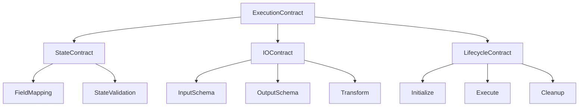

# Contract Relationships & Redesign Architecture

**Created**: 2025-01-07
**Purpose**: Define the formal relationships between components through contracts
**Status**: Design specification for implementation

## 🎯 Core Concept: Everything is a Contract

Instead of disconnected components guessing at each other, we establish formal contracts that define exact relationships.

## 📐 The Contract Hierarchy



## 🔗 Fundamental Relationships

### 1. Engine ↔ Contract Relationship

```python
class EngineContract:
    """Defines what an engine provides and requires."""

    # What the engine needs
    requires: InputContract = Field(...)

    # What the engine produces
    provides: OutputContract = Field(...)

    # How it interacts with state
    state_contract: StateContract = Field(...)

    # Resource requirements
    resources: ResourceContract = Field(...)

class InputContract:
    """Exactly what inputs an engine needs."""
    fields: Dict[str, FieldSpec] = {
        "messages": FieldSpec(
            type=List[BaseMessage],
            required=True,
            source="state.messages",
            transform=None
        ),
        "context": FieldSpec(
            type=Dict[str, Any],
            required=False,
            source="state.context",
            default_factory=dict
        )
    }

class OutputContract:
    """Exactly what an engine produces."""
    fields: Dict[str, FieldSpec] = {
        "response": FieldSpec(
            type=Union[str, BaseMessage],
            destination="state.messages",
            transform=ensure_message
        ),
        "metadata": FieldSpec(
            type=Dict[str, Any],
            destination="state.last_metadata",
            optional=True
        )
    }
```

### 2. Node ↔ Contract Relationship

```python
class NodeContract:
    """Contract-aware node that knows exactly what to do."""

    def __init__(self, contract: ExecutionContract):
        self.contract = contract
        # Pre-compile all extractors and updaters at creation
        self._compile_accessors()

    def _compile_accessors(self):
        """Pre-compile field access for zero runtime overhead."""
        self.extractors = {}
        self.updaters = {}

        for field_name, field_spec in self.contract.input.fields.items():
            # Create optimized getter
            path_parts = field_spec.source.split('.')
            self.extractors[field_name] = self._create_getter(path_parts)

        for field_name, field_spec in self.contract.output.fields.items():
            # Create optimized setter
            path_parts = field_spec.destination.split('.')
            self.updaters[field_name] = self._create_setter(path_parts)

    def __call__(self, state: State) -> State:
        """Execute with zero guessing."""
        # Extract exactly what's needed (pre-compiled)
        inputs = {
            name: extractor(state)
            for name, extractor in self.extractors.items()
        }

        # Execute the contract
        outputs = self.contract.execute(inputs)

        # Update exactly where needed (pre-compiled)
        for name, updater in self.updaters.items():
            if name in outputs:
                state = updater(state, outputs[name])

        return state
```

### 3. State ↔ Contract Relationship

```python
class StateContract:
    """Defines how state interacts with execution."""

    # Required state fields
    required_fields: Set[str] = Field(...)

    # Optional state fields
    optional_fields: Set[str] = Field(...)

    # Field access patterns
    access_patterns: Dict[str, AccessPattern] = Field(...)

    # Validation rules
    validators: List[Callable] = Field(...)

    def validate_state(self, state: State) -> ValidationResult:
        """Ensure state meets contract requirements."""
        missing = self.required_fields - set(state.model_fields.keys())
        if missing:
            return ValidationResult(
                valid=False,
                errors=[f"Missing required fields: {missing}"]
            )

        for validator in self.validators:
            result = validator(state)
            if not result.valid:
                return result

        return ValidationResult(valid=True)

class AccessPattern:
    """How a field is accessed."""
    mode: Literal["read", "write", "read_write"]
    frequency: Literal["once", "rare", "frequent"]
    size: Literal["small", "medium", "large"]

    def optimize_access(self) -> AccessStrategy:
        """Return optimized access strategy."""
        if self.frequency == "frequent" and self.size == "small":
            return CachedAccess()
        elif self.mode == "write" and self.size == "large":
            return BufferedAccess()
        else:
            return DirectAccess()
```

### 4. Graph ↔ Contract Relationship

```python
class GraphContract:
    """How nodes connect based on contracts."""

    def validate_edge(self, source: NodeContract, target: NodeContract) -> bool:
        """Ensure contracts are compatible."""
        # Target must be able to consume source output
        source_output = source.contract.output
        target_input = target.contract.input

        # Check type compatibility
        for field in target_input.required_fields:
            if field not in source_output.fields:
                return False

            source_type = source_output.fields[field].type
            target_type = target_input.fields[field].type

            if not is_compatible(source_type, target_type):
                return False

        return True

    def create_adapter(self, source: NodeContract, target: NodeContract) -> Optional[AdapterContract]:
        """Create adapter if contracts are incompatible but adaptable."""
        incompatibilities = self.find_incompatibilities(source, target)

        if not incompatibilities:
            return None

        # Build adapter contract
        adapter = AdapterContract()

        for issue in incompatibilities:
            if issue.type == "missing_field":
                adapter.add_default(issue.field, issue.default_value)
            elif issue.type == "type_mismatch":
                adapter.add_transform(issue.field, issue.transform)
            elif issue.type == "name_mismatch":
                adapter.add_mapping(issue.source_field, issue.target_field)

        return adapter
```

## 🏗️ Contract Composition Patterns

### 1. Sequential Composition

```python
class SequentialContract(ExecutionContract):
    """Chain contracts sequentially."""

    def __init__(self, contracts: List[ExecutionContract]):
        self.contracts = contracts
        self._validate_chain()
        self._optimize_chain()

    def _validate_chain(self):
        """Ensure each contract's output matches next's input."""
        for i in range(len(self.contracts) - 1):
            current = self.contracts[i]
            next_contract = self.contracts[i + 1]

            if not self._are_compatible(current.output, next_contract.input):
                raise ContractMismatch(
                    f"Contract {i} output incompatible with contract {i+1} input"
                )

    def _optimize_chain(self):
        """Optimize the chain execution."""
        # Eliminate intermediate representations
        self.direct_paths = {}

        for i in range(len(self.contracts) - 1):
            current = self.contracts[i]
            next_contract = self.contracts[i + 1]

            # Find fields that pass through unchanged
            passthrough = current.output.fields.keys() & next_contract.input.fields.keys()
            for field in passthrough:
                self.direct_paths[field] = (i, i + 1)

    def execute(self, input: Any) -> Any:
        """Execute the chain with optimizations."""
        result = input

        for i, contract in enumerate(self.contracts):
            # Check if we can skip intermediate processing
            if i in self.direct_paths:
                # Pass through directly
                result = self._execute_optimized(contract, result)
            else:
                result = contract.execute(result)

        return result
```

### 2. Parallel Composition

```python
class ParallelContract(ExecutionContract):
    """Execute contracts in parallel."""

    def __init__(self, contracts: List[ExecutionContract]):
        self.contracts = contracts
        self._prepare_parallel_execution()

    def _prepare_parallel_execution(self):
        """Prepare for parallel execution."""
        # Group by resource requirements
        self.cpu_bound = []
        self.io_bound = []
        self.gpu_bound = []

        for contract in self.contracts:
            if contract.resources.requires_gpu:
                self.gpu_bound.append(contract)
            elif contract.resources.is_io_bound:
                self.io_bound.append(contract)
            else:
                self.cpu_bound.append(contract)

    async def execute(self, input: Any) -> List[Any]:
        """Execute all contracts in parallel."""
        import asyncio

        tasks = []

        # Create tasks with appropriate executors
        for contract in self.cpu_bound:
            tasks.append(self._execute_cpu(contract, input))

        for contract in self.io_bound:
            tasks.append(self._execute_io(contract, input))

        for contract in self.gpu_bound:
            tasks.append(self._execute_gpu(contract, input))

        # Execute all in parallel
        results = await asyncio.gather(*tasks)
        return results
```

### 3. Conditional Composition

```python
class ConditionalContract(ExecutionContract):
    """Choose contract based on conditions."""

    def __init__(self, condition: ConditionContract, contracts: Dict[Any, ExecutionContract]):
        self.condition = condition
        self.contracts = contracts
        self._compile_conditions()

    def _compile_conditions(self):
        """Pre-compile condition checks."""
        self.compiled_conditions = {}

        for key, contract in self.contracts.items():
            if callable(key):
                # Pre-compile the condition function
                self.compiled_conditions[key] = compile(key, '<condition>', 'eval')
            else:
                # Direct value comparison
                self.compiled_conditions[key] = lambda x, k=key: x == k

    def execute(self, input: Any) -> Any:
        """Execute the appropriate contract."""
        # Evaluate condition
        condition_result = self.condition.execute(input)

        # Find matching contract
        for key, check in self.compiled_conditions.items():
            if check(condition_result):
                return self.contracts[key].execute(input)

        # Default contract
        if 'default' in self.contracts:
            return self.contracts['default'].execute(input)

        raise NoMatchingContract(f"No contract for condition result: {condition_result}")
```

## 🔄 Contract Lifecycle Management

```python
class ContractLifecycle:
    """Manages contract lifecycle."""

    def __init__(self, contract: ExecutionContract):
        self.contract = contract
        self.state = "uninitialized"
        self.resources = {}

    async def initialize(self):
        """Initialize contract and acquire resources."""
        if self.state != "uninitialized":
            return

        # Acquire resources
        if self.contract.resources.requires_gpu:
            self.resources['gpu'] = await acquire_gpu()

        if self.contract.resources.requires_memory:
            self.resources['memory'] = await allocate_memory(
                self.contract.resources.memory_size
            )

        # Initialize contract
        await self.contract.initialize(self.resources)
        self.state = "initialized"

    async def execute(self, input: Any) -> Any:
        """Execute with lifecycle management."""
        if self.state == "uninitialized":
            await self.initialize()

        self.state = "executing"

        try:
            result = await self.contract.execute(input)
            self.state = "completed"
            return result

        except Exception as e:
            self.state = "error"
            await self.cleanup()
            raise

    async def cleanup(self):
        """Clean up resources."""
        if self.state == "uninitialized":
            return

        # Clean up contract
        await self.contract.cleanup()

        # Release resources
        for resource in self.resources.values():
            await resource.release()

        self.resources.clear()
        self.state = "cleaned"
```

## 🎯 Tool Contract Integration

```python
class ToolContract(ExecutionContract):
    """Contract for tool integration."""

    def __init__(self, tool: BaseTool):
        self.tool = tool
        self._analyze_tool()

    def _analyze_tool(self):
        """Analyze tool to build contract."""
        # Extract input schema
        if hasattr(self.tool, 'args_schema'):
            self.input = IOContract.from_pydantic(self.tool.args_schema)
        else:
            # Infer from function signature
            self.input = IOContract.from_signature(self.tool.func)

        # Extract output schema
        if hasattr(self.tool, 'output_schema'):
            self.output = IOContract.from_pydantic(self.tool.output_schema)
        else:
            # Default to string output
            self.output = IOContract(fields={"result": FieldSpec(type=str)})

        # Determine execution mode
        if asyncio.iscoroutinefunction(self.tool.func):
            self.execution_mode = "async"
        else:
            self.execution_mode = "sync"

    def execute(self, input: Dict[str, Any]) -> Any:
        """Execute tool with contract validation."""
        # Validate input
        validated_input = self.input.validate(input)

        # Execute tool
        if self.execution_mode == "async":
            result = asyncio.run(self.tool.arun(**validated_input))
        else:
            result = self.tool.run(**validated_input)

        # Validate output
        return self.output.validate({"result": result})
```

## 🚀 Migration Strategy

### Phase 1: Contract Definition

```python
# Define base contracts
ExecutionContract
StateContract
IOContract
LifecycleContract
ResourceContract
```

### Phase 2: Wrapper Implementation

```python
# Wrap existing components
ContractedEngine(engine, contract)
ContractedNode(node, contract)
ContractedAgent(agent, contract)
```

### Phase 3: Native Implementation

```python
# New components built with contracts
class SmartAgent:
    contract: AgentContract = Field(...)

    def execute(self, state: State) -> State:
        # Direct contract execution
        return self.contract.execute(state)
```

## 📊 Benefits of Contract Relationships

### 1. Compile-Time Safety

- Type checking at contract definition
- Incompatibility detected before runtime
- No more guessing games

### 2. Performance Optimization

- Pre-compiled field accessors
- Optimized execution paths
- Resource management

### 3. Composability

- Contracts compose algebraically
- Type-safe composition
- Automatic adaptation

### 4. Maintainability

- Clear boundaries
- Explicit dependencies
- Independent testing

## 🎯 Next Steps

1. **Implement Core Contracts** - Base contract types
2. **Build Contract Compiler** - Optimization engine
3. **Create Adapters** - For existing components
4. **Migrate Components** - One by one
5. **Optimize Execution** - Leverage contracts fully

---

**This design establishes formal, explicit relationships between all components through contracts, eliminating guessing and enabling massive optimization.**
