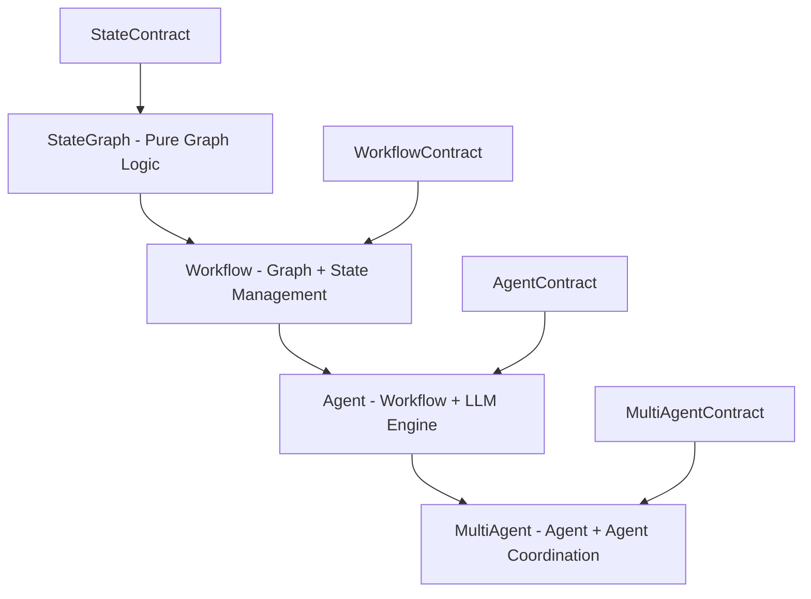

# StateGraph Recompilation & Workflow Hierarchy with Contracts

**Created**: 2025-01-07
**Purpose**: Design the StateGraph recompilation system and workflow hierarchy
**Status**: Architecture specification for StateGraph → Agent → MultiAgent

## 🎯 Core Concept: Contract-Driven Recompilation

Instead of the current approach where graphs blindly recompile when something changes, we use contracts to determine:

1. **What changed** - Specific contract modifications
2. **What's affected** - Dependencies through contract relationships
3. **How to recompile** - Optimized recompilation strategy

## 📐 Workflow Hierarchy with Contracts



## 🔄 StateGraph Recompilation System

### 1. Contract-Aware StateGraph

```python
class ContractedStateGraph(BaseGraph):
    """StateGraph that understands contracts for intelligent recompilation."""

    def __init__(self, state_contract: StateContract):
        super().__init__()
        self.state_contract = state_contract
        self.node_contracts: Dict[str, NodeContract] = {}
        self.compiled_graph: Optional[CompiledGraph] = None
        self.compilation_cache: CompilationCache = CompilationCache()

        # Track what triggers recompilation
        self.recompilation_triggers = RecompilationTriggers()

    def add_node_with_contract(
        self,
        name: str,
        node: Callable,
        contract: NodeContract
    ) -> 'ContractedStateGraph':
        """Add node with its contract."""
        # Validate contract compatibility with state
        if not self.state_contract.is_compatible(contract.state_requirements):
            raise ContractIncompatibility(
                f"Node {name} contract incompatible with graph state contract"
            )

        # Store both node and contract
        self.add_node(name, node)
        self.node_contracts[name] = contract

        # Mark for intelligent recompilation
        self._mark_node_change(name, contract)

        return self

    def _mark_node_change(self, node_name: str, contract: NodeContract):
        """Intelligently mark what needs recompilation."""
        # Determine impact scope
        impact = self._analyze_contract_impact(contract)

        if impact.is_local:
            # Only recompile this node's subgraph
            self.recompilation_triggers.add_local(node_name)
        elif impact.is_structural:
            # Need full graph recompilation
            self.recompilation_triggers.add_structural(node_name)
        else:
            # Just update metadata
            self.recompilation_triggers.add_metadata(node_name)

    def compile(self) -> CompiledGraph:
        """Compile with contract optimization."""
        if not self.recompilation_triggers.needs_recompilation():
            return self.compiled_graph

        strategy = self._determine_compilation_strategy()

        if strategy == CompilationStrategy.INCREMENTAL:
            return self._incremental_compile()
        elif strategy == CompilationStrategy.PARTIAL:
            return self._partial_compile()
        else:
            return self._full_compile()

    def _incremental_compile(self) -> CompiledGraph:
        """Only recompile changed parts."""
        changed_nodes = self.recompilation_triggers.get_changed_nodes()

        # Reuse existing compilation for unchanged parts
        partial_graph = self.compilation_cache.get_subgraph(changed_nodes)

        for node_name in changed_nodes:
            contract = self.node_contracts[node_name]

            # Pre-compile contract execution
            compiled_node = contract.compile()
            partial_graph.update_node(node_name, compiled_node)

        # Merge with unchanged parts
        self.compiled_graph = self.compilation_cache.merge(
            self.compiled_graph,
            partial_graph
        )

        self.recompilation_triggers.clear()
        return self.compiled_graph
```

### 2. Recompilation Triggers & Strategy

```python
class RecompilationTriggers:
    """Track what triggers recompilation and why."""

    def __init__(self):
        self.local_changes: Set[str] = set()  # Node-local changes
        self.structural_changes: Set[str] = set()  # Graph structure changes
        self.metadata_changes: Set[str] = set()  # Non-functional changes
        self.contract_changes: Dict[str, ContractDiff] = {}

    def add_contract_change(self, node: str, old: NodeContract, new: NodeContract):
        """Analyze contract changes to determine impact."""
        diff = ContractDiff.analyze(old, new)
        self.contract_changes[node] = diff

        if diff.affects_structure:
            self.structural_changes.add(node)
        elif diff.affects_execution:
            self.local_changes.add(node)
        else:
            self.metadata_changes.add(node)

    def needs_recompilation(self) -> bool:
        """Determine if recompilation is needed."""
        return bool(self.local_changes or self.structural_changes)

    def get_compilation_strategy(self) -> CompilationStrategy:
        """Determine optimal compilation strategy."""
        if self.structural_changes:
            return CompilationStrategy.FULL
        elif len(self.local_changes) > 5:
            return CompilationStrategy.PARTIAL
        elif self.local_changes:
            return CompilationStrategy.INCREMENTAL
        else:
            return CompilationStrategy.NONE

class ContractDiff:
    """Analyze differences between contracts."""

    @classmethod
    def analyze(cls, old: NodeContract, new: NodeContract) -> 'ContractDiff':
        diff = cls()

        # Check input changes
        old_inputs = set(old.input_contract.fields.keys())
        new_inputs = set(new.input_contract.fields.keys())

        if old_inputs != new_inputs:
            diff.input_changes = True
            diff.affects_structure = True

        # Check output changes
        old_outputs = set(old.output_contract.fields.keys())
        new_outputs = set(new.output_contract.fields.keys())

        if old_outputs != new_outputs:
            diff.output_changes = True
            diff.affects_structure = True

        # Check execution changes
        if old.execution_mode != new.execution_mode:
            diff.execution_changes = True
            diff.affects_execution = True

        return diff
```

### 3. Compilation Cache & Optimization

```python
class CompilationCache:
    """Cache compiled subgraphs for reuse."""

    def __init__(self):
        self.node_cache: Dict[str, CompiledNode] = {}
        self.subgraph_cache: Dict[FrozenSet[str], CompiledSubgraph] = {}
        self.execution_plans: Dict[str, ExecutionPlan] = {}

    def cache_node(self, name: str, node: CompiledNode):
        """Cache compiled node."""
        self.node_cache[name] = node

        # Also cache execution plan
        self.execution_plans[name] = node.create_execution_plan()

    def get_subgraph(self, nodes: Set[str]) -> CompiledSubgraph:
        """Get cached subgraph or create new."""
        key = frozenset(nodes)

        if key in self.subgraph_cache:
            return self.subgraph_cache[key]

        # Build subgraph from cached nodes
        subgraph = CompiledSubgraph()
        for node in nodes:
            if node in self.node_cache:
                subgraph.add_node(node, self.node_cache[node])

        self.subgraph_cache[key] = subgraph
        return subgraph

    def invalidate(self, nodes: Set[str]):
        """Invalidate cache for specific nodes."""
        for node in nodes:
            self.node_cache.pop(node, None)
            self.execution_plans.pop(node, None)

        # Invalidate subgraphs containing these nodes
        invalid_keys = [
            key for key in self.subgraph_cache
            if nodes & key
        ]
        for key in invalid_keys:
            del self.subgraph_cache[key]
```

## 🏗️ Workflow Contract (StateGraph + State Management)

```python
class WorkflowContract(Contract):
    """Contract for workflows - pure orchestration without LLM."""

    def __init__(self, state_contract: StateContract):
        self.state_contract = state_contract
        self.graph_contract = GraphContract()
        self.execution_contract = ExecutionContract()

    def validate_workflow(self, workflow: 'Workflow') -> ValidationResult:
        """Validate workflow against contract."""
        results = []

        # Validate state compatibility
        results.append(self.state_contract.validate(workflow.state_schema))

        # Validate graph structure
        results.append(self.graph_contract.validate(workflow.graph))

        # Validate execution flow
        results.append(self.execution_contract.validate(workflow.execution_mode))

        return ValidationResult.merge(results)

class Workflow(ContractedStateGraph):
    """Workflow: StateGraph + State Management (no LLM)."""

    def __init__(self, contract: WorkflowContract):
        super().__init__(contract.state_contract)
        self.contract = contract
        self.state_manager = StateManager(contract.state_contract)

    def run(self, initial_state: Optional[State] = None) -> State:
        """Execute workflow with state management."""
        # Initialize state
        state = self.state_manager.initialize(initial_state)

        # Compile if needed
        compiled = self.compile()

        # Execute with state tracking
        final_state = compiled.execute(state)

        # Persist state if configured
        self.state_manager.persist(final_state)

        return final_state
```

## 🤖 Agent Contract (Workflow + LLM)

```python
class AgentContract(WorkflowContract):
    """Contract for agents - workflow with LLM engine."""

    def __init__(
        self,
        state_contract: StateContract,
        engine_contract: EngineContract
    ):
        super().__init__(state_contract)
        self.engine_contract = engine_contract

        # Agents require specific state fields
        self.state_contract.add_requirement("messages", List[BaseMessage])
        self.state_contract.add_requirement("agent_state", Dict[str, Any])

    def create_agent_node(self) -> NodeContract:
        """Create the main agent node contract."""
        return NodeContract(
            input_contract=self.engine_contract.input,
            output_contract=self.engine_contract.output,
            execution=self.engine_contract.execute,
            state_requirements={"messages", "agent_state"}
        )

class Agent(Workflow):
    """Agent: Workflow + LLM Engine."""

    def __init__(
        self,
        contract: AgentContract,
        engine: Any,  # LLM engine
        tools: Optional[List[Tool]] = None
    ):
        super().__init__(contract)
        self.engine = engine
        self.tools = tools or []

        # Add agent node with contract
        agent_node_contract = contract.create_agent_node()
        self.add_node_with_contract(
            "agent",
            self._create_agent_callable(),
            agent_node_contract
        )

        # Add tool nodes if present
        if self.tools:
            self._add_tool_nodes()

    def _create_agent_callable(self) -> Callable:
        """Create the agent execution callable."""
        contract = self.contract.engine_contract

        def agent_executor(state: State) -> State:
            # Use contract for execution
            inputs = contract.extract(state)
            output = self.engine.invoke(inputs)
            return contract.update(state, output)

        return agent_executor

    def _add_tool_nodes(self):
        """Add tool nodes with contracts."""
        for tool in self.tools:
            tool_contract = ToolContract.from_tool(tool)

            self.add_node_with_contract(
                f"tool_{tool.name}",
                tool,
                tool_contract
            )

            # Add routing from agent to tools
            self.add_conditional_edges(
                "agent",
                self._should_use_tool,
                {tool.name: f"tool_{tool.name}" for tool in self.tools}
            )
```

## 🎭 MultiAgent Contract (Agent + Coordination)

```python
class MultiAgentContract(AgentContract):
    """Contract for multi-agent systems."""

    def __init__(
        self,
        state_contract: StateContract,
        agent_contracts: Dict[str, AgentContract],
        coordination_contract: CoordinationContract
    ):
        # MultiAgent has its own engine for coordination
        super().__init__(state_contract, coordination_contract.engine_contract)

        self.agent_contracts = agent_contracts
        self.coordination_contract = coordination_contract

        # Validate agent compatibility
        self._validate_agent_compatibility()

    def _validate_agent_compatibility(self):
        """Ensure agents can work together."""
        for name1, contract1 in self.agent_contracts.items():
            for name2, contract2 in self.agent_contracts.items():
                if name1 != name2:
                    # Check if outputs of agent1 can be inputs to agent2
                    compatibility = self._check_compatibility(
                        contract1.engine_contract.output,
                        contract2.engine_contract.input
                    )

                    if not compatibility.is_compatible:
                        # Need adapter
                        self.coordination_contract.add_adapter(
                            name1, name2, compatibility.create_adapter()
                        )

class CoordinationContract(Contract):
    """Contract for agent coordination."""

    def __init__(self, mode: str = "sequential"):
        self.mode = mode  # sequential, parallel, hierarchical, etc.
        self.routing_rules: Dict[str, RoutingRule] = {}
        self.adapters: Dict[Tuple[str, str], AdapterContract] = {}

        # Coordination engine (for routing decisions)
        self.engine_contract = EngineContract(
            input=IOContract(fields={
                "agent_outputs": FieldSpec(type=Dict[str, Any]),
                "coordination_state": FieldSpec(type=Dict[str, Any])
            }),
            output=IOContract(fields={
                "next_agent": FieldSpec(type=str),
                "adapted_input": FieldSpec(type=Dict[str, Any])
            })
        )

class MultiAgent(Agent):
    """MultiAgent: Agent coordination with LLM-driven routing."""

    def __init__(
        self,
        contract: MultiAgentContract,
        agents: Dict[str, Agent],
        coordinator_engine: Optional[Any] = None
    ):
        # Initialize with coordination engine
        super().__init__(
            contract,
            coordinator_engine or contract.coordination_contract.create_default_engine()
        )

        self.agents = agents
        self.coordination_contract = contract.coordination_contract

        # Build the multi-agent graph
        self._build_multi_agent_graph()

    def _build_multi_agent_graph(self):
        """Build graph with agent nodes and coordination."""
        # Add each agent as a subgraph
        for name, agent in self.agents.items():
            agent_contract = self.contract.agent_contracts[name]

            # Create agent subgraph
            subgraph = self._create_agent_subgraph(name, agent, agent_contract)

            # Add to main graph
            self.add_subgraph(name, subgraph)

        # Add coordination logic
        if self.coordination_contract.mode == "sequential":
            self._add_sequential_coordination()
        elif self.coordination_contract.mode == "parallel":
            self._add_parallel_coordination()
        elif self.coordination_contract.mode == "hierarchical":
            self._add_hierarchical_coordination()

    def _add_sequential_coordination(self):
        """Add sequential agent coordination."""
        agent_names = list(self.agents.keys())

        # Chain agents with adapters
        for i in range(len(agent_names) - 1):
            current = agent_names[i]
            next_agent = agent_names[i + 1]

            # Check if adapter needed
            adapter = self.coordination_contract.adapters.get((current, next_agent))

            if adapter:
                # Add adapter node
                self.add_node_with_contract(
                    f"adapter_{current}_{next_agent}",
                    adapter.create_callable(),
                    adapter
                )
                self.add_edge(current, f"adapter_{current}_{next_agent}")
                self.add_edge(f"adapter_{current}_{next_agent}", next_agent)
            else:
                # Direct connection
                self.add_edge(current, next_agent)

    def _add_hierarchical_coordination(self):
        """Add hierarchical coordination with coordinator making routing decisions."""
        # Coordinator node decides routing
        coordinator_contract = self.coordination_contract.engine_contract

        self.add_node_with_contract(
            "coordinator",
            self._create_coordinator_callable(),
            NodeContract.from_engine_contract(coordinator_contract)
        )

        # Coordinator routes to agents
        self.add_conditional_edges(
            "coordinator",
            lambda s: s.get("next_agent"),
            {name: name for name in self.agents.keys()}
        )

        # Agents report back to coordinator
        for name in self.agents.keys():
            self.add_edge(name, "coordinator")
```

## 🔄 Recompilation Optimization Strategies

### 1. Lazy Recompilation

```python
class LazyRecompilationStrategy:
    """Only recompile when actually needed."""

    def should_recompile(self, graph: ContractedStateGraph) -> bool:
        # Don't recompile for metadata changes
        if graph.recompilation_triggers.only_metadata():
            return False

        # Don't recompile if cached version is valid
        if graph.compilation_cache.is_valid():
            return False

        # Recompile if structural changes
        return graph.recompilation_triggers.has_structural_changes()
```

### 2. Parallel Compilation

```python
class ParallelCompilationStrategy:
    """Compile independent subgraphs in parallel."""

    async def compile(self, graph: ContractedStateGraph) -> CompiledGraph:
        # Identify independent subgraphs
        subgraphs = graph.identify_independent_subgraphs()

        # Compile in parallel
        tasks = []
        for subgraph in subgraphs:
            tasks.append(self._compile_subgraph(subgraph))

        compiled_subgraphs = await asyncio.gather(*tasks)

        # Merge results
        return self._merge_compiled_subgraphs(compiled_subgraphs)
```

### 3. Incremental Hot Reload

```python
class HotReloadStrategy:
    """Hot reload changed nodes without stopping execution."""

    def hot_reload(self, graph: ContractedStateGraph, changed_node: str):
        """Replace node while graph is running."""
        # Pause execution at safe point
        graph.pause_at_safe_point()

        # Compile just the changed node
        new_contract = graph.node_contracts[changed_node]
        compiled_node = new_contract.compile()

        # Atomic swap
        graph.compiled_graph.atomic_swap_node(changed_node, compiled_node)

        # Resume execution
        graph.resume()
```

## 📊 Benefits of Contract-Based Recompilation

### 1. Performance

- **Incremental compilation**: Only recompile what changed
- **Cached execution plans**: Reuse compiled nodes
- **Parallel compilation**: Compile independent parts simultaneously

### 2. Correctness

- **Contract validation**: Catch incompatibilities before runtime
- **Type safety**: Contracts ensure type compatibility
- **Atomic updates**: Safe hot reloading

### 3. Flexibility

- **Dynamic adaptation**: Add/remove agents at runtime
- **Automatic adapters**: Generate adapters for incompatible contracts
- **Strategy selection**: Choose optimal compilation strategy

---

**This architecture provides intelligent recompilation through contracts and a clean hierarchy from StateGraph → Workflow → Agent → MultiAgent, with each level adding specific capabilities through contracts.**
