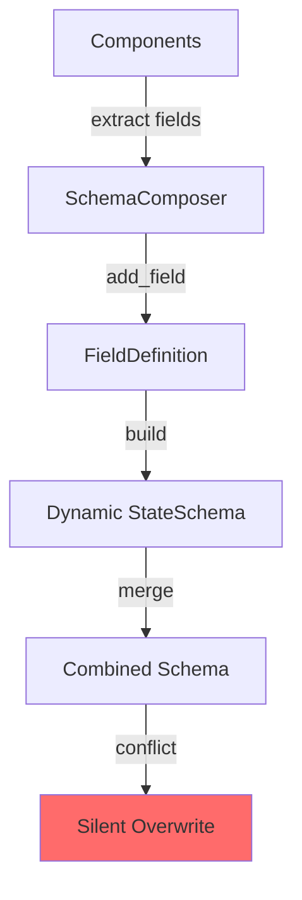

# Schema System Analysis - Phase 1

**Created**: 2025-01-06
**Status**: Initial Analysis Complete
**Files Analyzed**: 70+ schema-related files

## 🏗️ Architecture Overview

The Haive schema system is built around `StateSchema` as the base class, which extends Pydantic's `BaseModel` with graph-specific features. The system has grown to 70+ files with multiple layers of abstraction and composition patterns.

## 📊 Core Components

### 1. StateSchema (Base Class)

**File**: `state_schema.py`

The foundation class provides:

- **Field Sharing**: `__shared_fields__` - Controls which fields sync with parent graphs
- **Reducer Functions**: `__reducer_fields__` - Defines how field values merge during updates
- **Engine I/O Mappings**: `__engine_io_mappings__` - Maps fields to engine inputs/outputs
- **Generic Engine Support**: Generic types `TEngine` and `TEngines` for type safety
- **Built-in Fields**:
  - `engine: TEngine | None` - Optional primary engine
  - `engines: dict[str, Engine]` - Engine registry

**Key Design Decisions**:

- Uses class-level variables for metadata (shared fields, reducers, etc.)
- Validators handle both serialized dicts and actual Engine instances
- Heavy use of special dunder attributes for configuration

### 2. SchemaComposer (Dynamic Builder)

**File**: `schema_composer.py`

Provides dynamic schema creation:

- **Field Management**: `add_field()`, `add_fields_from_*()` methods
- **Component Integration**: Extracts fields from engines, models, dicts
- **Merge Strategy**: Simple overwrite on conflicts (line 2566)
- **Rich Visualization**: Extensive debugging and display capabilities

**Issues Identified**:

- 🚨 **No conflict resolution** - Last writer wins in merge operations
- 🚨 **No type checking** on field overwrites
- 🚨 **Silent field replacement** without warnings

### 3. Directory Structure

```
schema/
├── state_schema.py              # Base class
├── schema_composer.py           # Dynamic builder
├── schema_manager.py            # Runtime management
├── agent_schema_composer.py     # Agent-specific composition
├── compatibility/               # 17 files for type compatibility
│   ├── analyzer.py
│   ├── converters.py
│   ├── field_mapping.py
│   └── ...
├── composer/                    # Advanced composition
│   ├── engine/                  # Engine detection and management
│   └── field/                   # Field management
├── prebuilt/                    # 23 prebuilt schemas
│   ├── messages_state.py
│   ├── meta_state.py
│   ├── multi_agent_state.py
│   └── ...
└── mixins/                      # Schema mixins
```

## 🚨 Critical Issues Found

### 1. Field Conflict Resolution

**Severity**: HIGH
**Location**: `schema_composer.py:2566`

```python
# Add fields from second composer (overwriting if they exist)
```

- No warning when fields are overwritten
- No type compatibility checking
- No option to choose resolution strategy
- Silent data loss potential

### 2. Proliferation of Schema Files

**Severity**: MEDIUM

- 70+ schema-related files indicate possible over-engineering
- Multiple overlapping implementations:
  - `multi_agent_state.py`
  - `enhanced_multi_agent_state.py`
  - `flexible_multi_agent_state.py`
  - `multi_agent_state_schema.py`
- Unclear which to use when

### 3. Engine Validation Workaround

**Severity**: MEDIUM
**Location**: `state_schema.py:216-235`

```python
@field_validator("engine", mode="before")
def validate_engine(cls, v):
    if isinstance(v, dict):
        # It's a serialized engine - keep as dict to avoid instantiation
        return v
```

- Accepts both Engine instances and dicts
- Prevents "Can't instantiate abstract class Engine" errors
- But creates type ambiguity (engine can be Engine or dict)

### 4. Complex Inheritance Chains

**Severity**: MEDIUM

Multiple levels of schema inheritance create complexity:

- `StateSchema` → `MessagesState` → `MultiAgentState` → `EnhancedMultiAgentState`
- Each level adds its own special attributes
- Difficult to track field origins

## 🔍 Schema Composition Flow



## 💡 Design Patterns Observed

### 1. Dynamic Schema Creation

- Uses Pydantic's `create_model()` extensively
- Runtime schema generation based on available components
- Flexible but lacks compile-time type safety

### 2. Metadata via Class Variables

- Special dunder attributes for configuration
- Not instance-specific, applies to all instances
- Makes schemas less flexible at runtime

### 3. Reducer Pattern

- Borrowed from Redux/LangGraph patterns
- Functions define how to merge field values
- But no standard library of reducers

## 🎯 Recommendations

### Immediate Fixes

1. **Add Conflict Resolution Strategy**

   ```python
   class ConflictStrategy(Enum):
       OVERWRITE = "overwrite"
       MERGE = "merge"
       ERROR = "error"
       KEEP_FIRST = "keep_first"
   ```

2. **Type Checking on Merge**
   - Verify field types match before overwriting
   - Warn on incompatible types
   - Option to abort on conflicts

3. **Consolidate Schema Variants**
   - Audit all 23 prebuilt schemas
   - Identify redundant implementations
   - Create clear hierarchy documentation

### Long-term Improvements

1. **Schema Registry Pattern**
   - Central registry for all schemas
   - Version tracking
   - Dependency management

2. **Field Composition Rules**
   - Explicit rules for field merging
   - Type coercion policies
   - Validation at composition time

3. **Simplify Special Attributes**
   - Consider builder pattern instead of class variables
   - Make configuration more explicit
   - Improve discoverability

## 📈 Metrics

- **Total Schema Files**: 70+
- **Prebuilt Schemas**: 23
- **Compatibility Modules**: 17
- **Lines of Code**: ~15,000+ (estimated)
- **Inheritance Depth**: Up to 4 levels
- **Special Attributes**: 10+ different `__*__` variables

## 🔗 Related Components

- **Engine System**: Tightly coupled via `__engine_io_mappings__`
- **Graph System**: Depends on field sharing and reducers
- **Node System**: Uses schemas for state passing

## 🔍 Deep Dive: StateSchema Critical Analysis

### Fundamental Design Issues

#### 1. **Class-Level vs Instance-Level Configuration**

The StateSchema uses class-level variables for configuration:

```python
__shared_fields__ = []
__reducer_fields__ = {}
__engine_io_mappings__ = {}
```

**Problems**:

- All instances share the same configuration
- Can't have different configurations per instance
- Runtime modification affects ALL instances of that class
- Makes testing harder (global state)

**Question**: Why not use instance-level configuration with a builder pattern?

#### 2. **Reducer System Inconsistencies**

The `apply_reducers()` method has fallback behavior that can be unpredictable:

- Line 1004-1008: Auto-concatenates lists even without reducer
- Line 1012-1017: Auto-merges dicts even without reducer
- Line 1020: Falls back to simple assignment

**Problem**: This creates implicit behavior that may not be desired. What if I want to REPLACE a list, not concatenate?

#### 3. **Engine Validation Ambiguity**

Lines 216-235: The engine field accepts both Engine instances AND dicts:

```python
if isinstance(v, dict):
    # Keep as dict to avoid instantiation
    return v
```

**Problems**:

- Type system says `engine: Engine` but it can be a dict
- Code using engine must always check type
- Breaks type safety guarantees
- Why not use a separate serialized_engine field?

#### 4. **Method Explosion**

StateSchema has 60+ methods! Including:

- Multiple ways to get engines (get_engine, get_instance_engine, get_class_engine)
- Multiple dict conversions (dict, to_dict, model_dump)
- Multiple update methods (update, apply_reducers)

**Question**: Is this violating Single Responsibility Principle?

### Architectural Concerns

#### 5. **Inheritance Depth & Complexity**

With 4+ levels of inheritance and 70+ schema files:

- Which schema should I use for what?
- What's the difference between:
  - `MultiAgentState`
  - `EnhancedMultiAgentState`
  - `FlexibleMultiAgentState`
  - `MultiAgentStateSchema`

#### 6. **Hidden Dependencies**

The schema system depends on:

- LangGraph (for add_messages reducer)
- LangChain (for BaseMessage)
- Rich (for visualization)
- Multiple internal modules

**Question**: Should a core schema have so many dependencies?

#### 7. **No Clear Composition Strategy**

SchemaComposer line 2566: "overwriting if they exist"

- No merge strategies
- No conflict warnings
- No type checking on overwrites

**What happens when**:

- Two schemas have same field with different types?
- Reducers conflict?
- Shared fields have different meanings?

### Performance & Scalability

#### 8. **Runtime Type Creation**

Heavy use of `create_model()` for dynamic schemas:

- Performance overhead
- No compile-time type checking
- IDE can't provide autocomplete
- Debugging is harder

#### 9. **Deep Copy Operations**

Multiple deep copy operations throughout:

- `deep_copy()` method
- Copying in reducers
- Copying in merge operations

**Question**: Impact on large state objects with nested structures?

## 📋 Critical Questions for Team

1. **Why class-level configuration?**
   - Was this a conscious design choice?
   - What prevents instance-level config?

2. **Reducer fallback behavior**:
   - Should list/dict auto-merge be explicit?
   - How to override default behavior?

3. **Schema proliferation**:
   - Can we reduce from 70+ files to <20?
   - Clear guidelines on which to use?

4. **Type safety**:
   - How to maintain with dynamic schemas?
   - Why allow dict for Engine fields?

5. **Testing strategy**:
   - How to test class-level config changes?
   - How to test schema composition?

## 🚨 Immediate Recommendations

1. **Add Conflict Detection**:

```python
def merge_with_strategy(schema1, schema2, strategy="error"):
    if strategy == "error" and has_conflicts(schema1, schema2):
        raise SchemaConflictError(conflicts)
```

2. **Explicit Reducer Control**:

```python
class FieldConfig:
    merge_strategy: Literal["replace", "concat", "merge", "custom"]
    custom_reducer: Optional[Callable]
```

3. **Separate Serialization Concerns**:

```python
class StateSchema:
    engine: Engine  # Always Engine

class SerializedStateSchema:
    engine: dict  # Always dict
```

4. **Document Schema Hierarchy**:

- Create decision tree for schema selection
- Deprecate redundant schemas
- Clear naming conventions

## 📝 Notes for Discussion

1. **Schema Explosion**: Why so many schema variants? Can we consolidate?
2. **Field Conflicts**: What's the intended behavior? Need clear policy.
3. **Type Safety**: How to maintain with dynamic schemas?
4. **Performance**: Impact of deep inheritance and validation?
5. **Testing**: How to test schema composition thoroughly?
6. **Class vs Instance Config**: Why this design choice?
7. **Reducer Fallbacks**: Should they be explicit?
8. **Method Count**: Can we simplify the API?

---

**Next Phase**: [Engine System Analysis](./engine_system.md)
