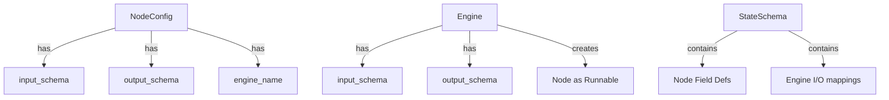
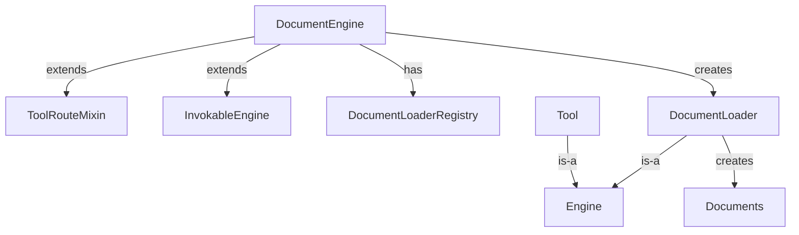
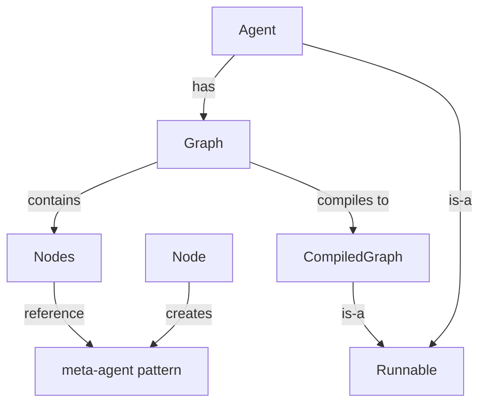
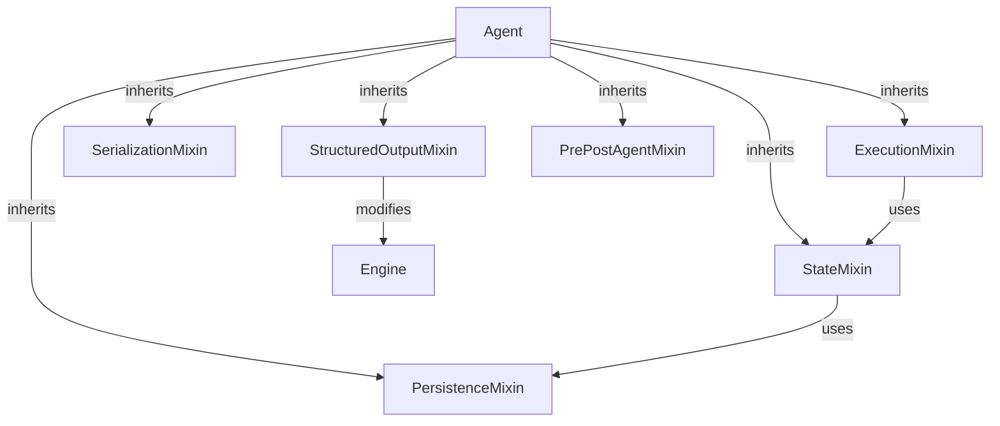

# Circular Dependency Map - Haive Architecture

**Created**: 2025-01-30  
**Purpose**: Document all circular dependencies and identity confusion  
**Current Complexity**: 82🔥

## 🔴 Critical Circular Dependencies

### 1. Agent ↔ Engine Circularity

```mermaid
graph TD
    Agent[Agent] -->|extends| InvokableEngine[InvokableEngine]
    Agent -->|has field| Engine[engine: Engine]
    Agent -->|has dict| Engines[engines: dict[str, Engine]]
    InvokableEngine -->|is-a| Engine
    Engine -->|creates| Agent[Agent as Runnable]
```

**Files Involved**:

- `/haive-agents/src/haive/agents/base/agent.py` (line 50-51)
- `/haive-core/src/haive/core/engine/base/base.py`

**Problem**: Agent both IS an engine and HAS engines

### 2. Node ↔ Engine ↔ Schema Circularity



**Files Involved**:

- `/haive-core/src/haive/core/graph/node/base_config.py`
- `/haive-core/src/haive/core/engine/base/base.py`
- `/haive-core/src/haive/core/schema/state_schema.py`

**Problem**: Three different schema systems trying to describe the same thing

### 3. Document System Circularity



**Files Involved**:

- `/haive-core/src/haive/core/engine/document/engine.py` (line 46-49)
- `/haive-core/src/haive/core/engine/document/loaders/base.py`

**Problem**: Document engine is simultaneously a tool, an engine, and a factory

### 4. Tool ↔ Engine Circularity

```mermaid
graph TD
    ToolEngine -->|extends| InvokableEngine
    Tool -->|can be| BaseModel
    Tool -->|can be| Function
    Tool -->|can be| Engine
    StructuredOutput -->|becomes| Tool
    Agent -->|has| tools[tools: list]
    Agent -->|is| Tool[when as_tool()]
```

**Files Involved**:

- `/haive-core/src/haive/core/engine/tool/engine.py`
- `/haive-core/src/haive/core/common/mixins/tool_route_mixin.py`
- `/haive-agents/src/haive/agents/base/agent.py`

**Problem**: Tools can be engines, engines can be tools, agents can be tools

### 5. Graph ↔ Agent ↔ Node Circularity



**Files Involved**:

- `/haive-agents/src/haive/agents/base/agent.py` (line 99-100)
- `/haive-core/src/haive/core/graph/state_graph/base_graph2.py`
- `/haive-core/src/haive/core/graph/node/meta_agent_node.py`

**Problem**: Agents contain graphs which contain nodes which can create agents

### 6. Mixin Dependency Web



**Files Involved**:

- `/haive-agents/src/haive/agents/base/agent.py` (line 50-58)
- Various mixin files in `/haive-agents/src/haive/agents/base/mixins/`

**Problem**: Mixins have interdependencies creating a tangled web

## 🟠 Identity Confusion Issues

### Everything Can Be Everything

| Component | Can Be      | Also Can Be     | And Also    |
| --------- | ----------- | --------------- | ----------- |
| Agent     | Engine      | Tool            | Runnable    |
| Engine    | Factory     | Config          | Executable  |
| Tool      | Engine      | BaseModel       | Function    |
| Node      | Runnable    | Agent Container | Engine User |
| Document  | Engine      | Tool            | Loader      |
| Schema    | StateSchema | BaseModel       | dict        |

## 🟡 Schema System Proliferation

Different schema systems in use:

1. **Pydantic BaseModel** - Standard models
2. **StateSchema** - Enhanced with reducers, sharing
3. **FieldDefinition** - Custom field system
4. **SchemaComposer** - Dynamic schema builder
5. **dict[str, Any]** - Untyped dictionaries
6. **create_model()** - Runtime model generation

Each component uses 2-3 of these simultaneously!

## 📊 Dependency Statistics

| Metric                       | Count |
| ---------------------------- | ----- |
| Direct circular dependencies | 6+    |
| Identity confusion cases     | 15+   |
| Schema systems               | 6     |
| Mixin interdependencies      | 10+   |
| Files affected               | 50+   |
| Coupling complexity          | 82🔥  |

## 🎯 Breaking the Circles - Priority Order

### Phase 1: Identity Separation (Weeks 1-2)

1. **Agent ≠ Engine**: Remove InvokableEngine inheritance
2. **Tool ≠ Engine**: Create clear Tool abstraction
3. **Document ≠ Tool**: Separate document processing from tools

### Phase 2: Schema Unification (Weeks 3-4)

1. Choose ONE schema system (recommend Pydantic BaseModel)
2. Remove FieldDefinition
3. Simplify StateSchema to decorator pattern
4. Replace runtime create_model with static types

### Phase 3: Contract Introduction (Weeks 5-6)

1. Define ExecutableProtocol
2. Define FactoryProtocol
3. Define SchemaProviderProtocol
4. Implement protocols in components

### Phase 4: Mixin Simplification (Week 7)

1. Reduce mixin count from 7+ to 3-4
2. Remove interdependencies
3. Make mixins truly independent

## 💡 Key Insight

The 82🔥 complexity score comes from these circular dependencies creating a system where:

- You can't change one thing without changing everything
- Type information is lost through multiple transformations
- Components don't have clear responsibilities
- Testing requires the entire system

**Solution**: Give each component ONE identity and ONE responsibility. Use composition, not inheritance.
