# Haive Agent Documentation Hub

## 🤖 Agent Categories Overview

This document serves as the main entry point for all agent-related documentation. Agents are organized by their primary function and use case.

## 📊 Agent Hierarchy (Actual Implementations)

```mermaid
graph TD
    A[Haive Agents] --> B[Core Base Agents]
    A --> C[RAG Agents]
    A --> D[Planning Agents]
    A --> E[Reasoning & Critique]
    A --> F[Conversation Agents]
    A --> G[Document Processing]
    A --> H[Game Agents]
    A --> I[Specialized Agents]

    B --> B1[Agent - Base Class]
    B --> B2[SimpleAgent]
    B --> B3[ReactAgent]
    B --> B4[BaseRAGAgent]
    B --> B5[MultiAgent]

    C --> C1[AdaptiveRAGAgent]
    C --> C2[CorrectiveRAGAgent]
    C --> C3[HyDEAgent]
    C --> C4[FusionRAGAgent]
    C --> C5[SelfReflectiveRAGAgent]
    C --> C6[MemoryAwareRAGAgent]
    C --> C7[MultiQueryRAGAgent]
    C --> C8[SpeculativeRAGAgent]
    C --> C9[StepBackRAGAgent]
    C --> C10[SQL RAGAgent]
    C --> C11[Graph DB RAGAgent]

    D --> D1[PlanAndExecuteAgent]
    D --> D2[ReWOOAgent]
    D --> D3[LLMCompilerAgent]

    E --> E1[LogicAgent]
    E --> E2[ReflectionAgent]
    E --> E3[ReflexionAgent]
    E --> E4[TreeOfThoughtsAgent]
    E --> E5[LATSAgent]
    E --> E6[MCTSAgent]
    E --> E7[SelfDiscoverAgent]

    F --> F1[BaseConversationAgent]
    F --> F2[DebateAgent]
    F --> F3[CollaborativeAgent]
    F --> F4[RoundRobinAgent]
    F --> F5[DirectedAgent]
    F --> F6[SocialMediaAgent]

    G --> G1[DocumentLoaderAgent]
    G --> G2[DirectoryLoaderAgent]
    G --> G3[FileLoaderAgent]
    G --> G4[WebLoaderAgent]
    G --> G5[ComplexExtractionAgent]
    G --> G6[SummarizerAgent]
    G --> G7[KnowledgeGraphAgent]

    H --> H1[Strategy Board Games]
    H --> H2[Card Game Agents]
    H --> H3[Social Deduction]
    H --> H4[Logic/Puzzle Games]
    H --> H5[Single Player Games]

    H1 --> H1A[ChessAgent]
    H1 --> H1B[CheckersAgent]
    H1 --> H1C[GoAgent]
    H1 --> H1D[ReversiAgent]
    H1 --> H1E[Connect4Agent]
    H1 --> H1F[TicTacToeAgent]
    H1 --> H1G[MancalaAgent]

    H2 --> H2A[PokerAgent]
    H2 --> H2B[HoldEmAgent]
    H2 --> H2C[BlackjackAgent]
    H2 --> H2D[BSAgent]

    H3 --> H3A[AmongUsAgent]
    H3 --> H3B[MafiaAgent]
    H3 --> H3C[ClueAgent]

    H4 --> H4A[MastermindAgent]
    H4 --> H4B[NimAgent]
    H4 --> H4C[FoxAndGeeseAgent]

    H5 --> H5A[WordleAgent]
    H5 --> H5B[RubiksAgent]
    H5 --> H5C[FlowFreeAgent]

    I --> I1[PersonResearchAgent]
    I --> I2[OpenPerplexityAgent]
    I --> I3[WikiWriterAgent]
    I --> I4[InterviewAgent]
    I --> I5[SelfHealingCodeAgent]
    I --> I6[TaskAnalysisAgent]
    I --> I7[SequentialAgent]
    I --> I8[SupervisorAgent]
    I --> I9[DynamicSupervisorAgent]
    I --> I10[LongTermMemoryAgent]
    I --> I11[MemoryAgent]
```



## 🗂️ Agent Group Documentation

### 1. Core Base Agents

**Purpose**: Foundation classes for all agent implementations
**Key Agents**: Agent (base), SimpleAgent, ReactAgent, BaseRAGAgent, MultiAgent
**Use Cases**: Building blocks for all other agents

### 2. RAG Agents (25+ Implementations)

**Purpose**: Retrieval-augmented generation with various strategies
**Key Agents**: AdaptiveRAGAgent, CorrectiveRAGAgent, HyDEAgent, FusionRAGAgent
**Use Cases**: Knowledge-grounded responses, document Q&A, research assistance

### 3. Planning Agents

**Purpose**: Task decomposition and execution planning
**Key Agents**: PlanAndExecuteAgent, ReWOOAgent, LLMCompilerAgent
**Use Cases**: Complex workflow automation, code generation, multi-step tasks

### 4. Reasoning & Critique Agents

**Purpose**: Advanced reasoning and self-reflection
**Key Agents**: TreeOfThoughtsAgent, ReflectionAgent, LogicAgent, MCTSAgent
**Use Cases**: Complex problem solving, logical reasoning, strategic planning

### 5. Conversation Agents

**Purpose**: Multi-party dialogue and conversation management
**Key Agents**: DebateAgent, CollaborativeAgent, RoundRobinAgent
**Use Cases**: Facilitated discussions, team coordination, social media

### 6. Document Processing Agents

**Purpose**: Document loading, extraction, and processing
**Key Agents**: DocumentLoaderAgent, SummarizerAgent, KnowledgeGraphAgent
**Use Cases**: Document analysis, content extraction, knowledge management

### 7. Game Agents (30+ Implementations)

**Purpose**: Game playing and strategy development
**Key Games**: Chess, Go, Poker, Among Us, Wordle, Tic-tac-toe
**Use Cases**: Game AI, strategy testing, entertainment

### 8. Specialized Agents

**Purpose**: Domain-specific and utility agents
**Key Agents**: PersonResearchAgent, WikiWriterAgent, SelfHealingCodeAgent
**Use Cases**: Research, content creation, code maintenance

## 🚀 Quick Start by Use Case

### "I want to build a chatbot"

→ Start with **SimpleAgent** or **BaseConversationAgent**

### "I need to automate a workflow"

→ Use **PlanAndExecuteAgent** or **ReactAgent**

### "I'm building a game AI"

→ Check **haive-games** package (ChessAgent, GoAgent, PokerAgent, etc.)

### "I need document Q&A"

→ Use **BaseRAGAgent** or **AdaptiveRAGAgent**

### "I want advanced reasoning"

→ Try **TreeOfThoughtsAgent** or **ReflectionAgent**

### "I need research capabilities"

→ Use **PersonResearchAgent** or **OpenPerplexityAgent**

### "I want multi-agent coordination"

→ Use **MultiAgent** or **SupervisorAgent**

## 📋 Common Agent Patterns (Actual Implementations)

### 1. **Simple Conversational Agent**

```python
from haive.agents.simple import SimpleAgent
from haive.core.engine.aug_llm import AugLLMConfig

# Basic conversational agent
agent = SimpleAgent(
    name="chat_agent",
    engine=AugLLMConfig()
)

response = await agent.arun("Hello!")
```

### 2. **RAG Agent with Documents**

```python
from haive.agents.rag.base import BaseRAGAgent

# RAG agent with document knowledge
agent = BaseRAGAgent.from_documents(
    documents=["doc1.txt", "doc2.txt"],
    name="knowledge_agent"
)

response = await agent.arun("What does the document say about X?")
```

### 3. **Multi-Step Planning Agent**

```python
from haive.agents.planning.plan_and_execute import PlanAndExecuteAgent

# Planning agent for complex tasks
agent = PlanAndExecuteAgent(
    name="planner",
    engine=AugLLMConfig()
)

response = await agent.arun("Write a research report on AI trends")
```

### 4. **Game Playing Agent**

```python
from haive.games.chess import ChessAgent

# Chess playing agent
agent = ChessAgent(
    name="chess_player",
    difficulty="intermediate"
)

move = await agent.make_move(board_state)
```

### 5. **Multi-Agent Coordination**

```python
from haive.agents.multi import MultiAgent

# Coordinate multiple agents
multi_agent = MultiAgent(
    name="team",
    agents=[researcher, writer, reviewer]
)

result = await multi_agent.arun("Create a comprehensive report")
```

## 🏗️ Agent Development Workflow

1. **Identify Agent Type** → Choose from categories above
2. **Read Group Documentation** → Follow specific patterns
3. **Use Standard Template** → See [CLAUDE_AGENT_TEMPLATE.md](./CLAUDE_AGENT_TEMPLATE.md)
4. **Implement Core Logic** → Follow examples in group docs
5. **Add Tests** → Use `poetry run pytest`
6. **Document** → Update relevant group documentation

## 🧪 Testing Agents

```bash
# Run all agent tests
poetry run pytest packages/haive-agents/tests/

# Run specific agent group tests
poetry run pytest packages/haive-agents/tests/test_conversational.py

# Run with debugging
poetry run pytest -xvs packages/haive-agents/tests/test_your_agent.py
```

## 📊 Agent Performance Metrics

### Key Metrics to Track

1. **Response Time**: Target < 2s for conversational, < 30s for complex tasks
2. **Token Usage**: Monitor input/output tokens
3. **Success Rate**: Task completion percentage
4. **Error Rate**: Failed operations tracking
5. **User Satisfaction**: Feedback scores

### Monitoring Example

```python
from haive.monitoring import AgentMonitor

monitor = AgentMonitor(agent_name="your_agent")
with monitor.track_performance():
    result = await agent.run(input)
    monitor.log_success(result)
```

## 🔧 Agent Configuration

### Standard Configuration Structure

```python
agent_config = {
    "name": "agent_name",
    "type": "conversational|task|game|tool|specialized",
    "model": {
        "provider": "openai|anthropic|local",
        "name": "gpt-4|claude-3|llama",
        "temperature": 0.7,
        "max_tokens": 2000
    },
    "tools": ["tool1", "tool2"],
    "memory": {
        "type": "conversation_buffer|summary|vector",
        "size": 1000
    },
    "behaviors": {
        "retry_on_error": True,
        "max_retries": 3,
        "timeout": 30
    }
}
```

## 🌟 Best Practices

1. **Start Simple** - Begin with basic agent, add complexity gradually
2. **Use Existing Patterns** - Don't reinvent the wheel
3. **Test Thoroughly** - Include edge cases and error scenarios
4. **Document Intent** - Explain why, not just what
5. **Monitor Performance** - Track metrics from day one
6. **Version Control** - Track agent configurations

## 📚 Additional Resources

- **Agent Showcase**: `/docs/source/agents/showcase.rst`
- **API Reference**: `/docs/source/api/agents.rst`
- **Examples**: `/packages/haive-agents/examples/`
- **Templates**: `/CLAUDE_AGENT_TEMPLATE.md`

## 🤝 Contributing

To add new agent types or improve documentation:

1. Follow [DOCUMENTATION_STANDARDS.md](./DOCUMENTATION_STANDARDS.md)
2. Update relevant group documentation
3. Add examples and test cases
4. Submit PR with clear description

---

**Navigation**: Return to [CLAUDE.md](../../CLAUDE.md) | View [All Agent Groups](#agent-group-documentation)
