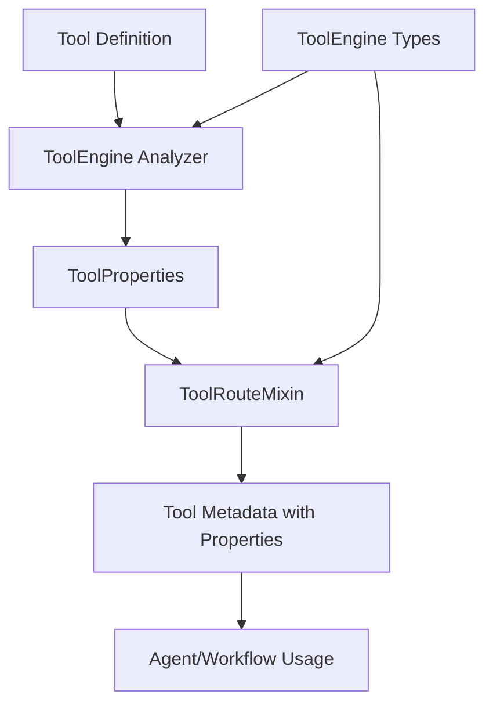

# Integrated Tool Typing Architecture

**Date**: 2025-08-08  
**Goal**: Make ToolRouteMixin aware of and use ToolEngine's tool type system

## Architecture Overview

Instead of separate typing systems, we'll have:

- **ToolEngine** defines the universal tool types and capabilities
- **ToolRouteMixin** consumes and uses those definitions
- Single source of truth for tool typing

## 1. ToolEngine as the Type Definition Source

```python
# In haive.core.engine.tool.types
class ToolCapability(str, Enum):
    """Universal tool capabilities defined by ToolEngine."""
    INTERRUPTIBLE = "interruptible"
    STATE_READER = "state_reader"
    STATE_WRITER = "state_writer"
    STRUCTURED_OUTPUT = "structured_output"
    ASYNC_CAPABLE = "async_capable"
    STREAMABLE = "streamable"
    RETRIEVER = "retriever"
    VALIDATOR = "validator"
    TRANSFORMER = "transformer"

class ToolProperties(BaseModel):
    """Tool properties as defined by ToolEngine."""
    tool_type: ToolType  # From ToolEngine
    capabilities: set[ToolCapability] = Field(default_factory=set)
    metadata: dict[str, Any] = Field(default_factory=dict)

    # Quick capability checks
    @property
    def is_interruptible(self) -> bool:
        return ToolCapability.INTERRUPTIBLE in self.capabilities

    @property
    def reads_state(self) -> bool:
        return ToolCapability.STATE_READER in self.capabilities

    @property
    def writes_state(self) -> bool:
        return ToolCapability.STATE_WRITER in self.capabilities
```

## 2. ToolRouteMixin Aware of ToolEngine Types

```python
# Modified ToolRouteMixin
class ToolRouteMixin:
    """Tool routing mixin aware of ToolEngine types."""

    def _analyze_tool(self, tool: Any, name: str | None = None) -> dict[str, Any]:
        """Analyze tool using ToolEngine type system."""

        # Get base metadata from parent
        metadata = super()._analyze_tool(tool, name) if hasattr(super(), '_analyze_tool') else {}

        # Import ToolEngine types
        from haive.core.engine.tool.types import ToolProperties, ToolCapability
        from haive.core.engine.tool.analyzer import ToolAnalyzer

        # Use ToolEngine's analyzer
        analyzer = ToolAnalyzer()
        tool_properties = analyzer.analyze(tool)

        # Merge with metadata
        metadata.update({
            "tool_properties": tool_properties,
            "tool_type": tool_properties.tool_type,
            "capabilities": list(tool_properties.capabilities),

            # Convenience fields from properties
            "is_interruptible": tool_properties.is_interruptible,
            "reads_state": tool_properties.reads_state,
            "writes_state": tool_properties.writes_state,
            "has_structured_output": ToolCapability.STRUCTURED_OUTPUT in tool_properties.capabilities
        })

        return metadata

    def get_tools_by_capability(self, capability: ToolCapability) -> list[Any]:
        """Get tools with specific capability."""
        matching_tools = []

        for tool_name, metadata in self.tool_metadata.items():
            properties = metadata.get("tool_properties")
            if properties and capability in properties.capabilities:
                matching_tools.append(self.tools_dict[tool_name])

        return matching_tools
```

## 3. ToolEngine Analyzer Component

```python
# In haive.core.engine.tool.analyzer
class ToolAnalyzer:
    """Analyzes tools to determine their properties using ToolEngine definitions."""

    def analyze(self, tool: Any) -> ToolProperties:
        """Analyze tool and return its properties."""
        from haive.core.engine.tool.types import ToolCapability, ToolProperties, ToolType

        # Determine base tool type
        tool_type = self._determine_tool_type(tool)

        # Analyze capabilities
        capabilities = set()

        # Check interruptibility
        if self._is_interruptible(tool):
            capabilities.add(ToolCapability.INTERRUPTIBLE)

        # Check state interaction
        if self._reads_state(tool):
            capabilities.add(ToolCapability.STATE_READER)
        if self._writes_state(tool):
            capabilities.add(ToolCapability.STATE_WRITER)

        # Check output type
        if self._has_structured_output(tool):
            capabilities.add(ToolCapability.STRUCTURED_OUTPUT)

        # Check execution mode
        if self._is_async(tool):
            capabilities.add(ToolCapability.ASYNC_CAPABLE)

        # Check if it's a retriever
        if self._is_retriever(tool):
            capabilities.add(ToolCapability.RETRIEVER)

        # Additional metadata
        metadata = {
            "output_schema": self._extract_output_schema(tool),
            "input_schema": self._extract_input_schema(tool),
            "estimated_duration": self._estimate_duration(tool),
            "requires_network": self._requires_network(tool)
        }

        return ToolProperties(
            tool_type=tool_type,
            capabilities=capabilities,
            metadata=metadata
        )

    def _is_interruptible(self, tool: Any) -> bool:
        """Check if tool is interruptible using centralized logic."""
        from haive.core.common.utils.interrupt_utils import is_interruptible

        # Use existing utility but also check for ToolEngine markers
        if is_interruptible(tool):
            return True

        # Check for ToolEngine interruptible marker
        if hasattr(tool, '__tool_capabilities__'):
            return ToolCapability.INTERRUPTIBLE in tool.__tool_capabilities__

        return False
```

## 4. Integration Flow



## 5. Making Tools Declare Their Type

```python
# Tools can explicitly declare their ToolEngine type
@tool
class RetrieverTool:
    """A retriever tool that declares its type."""

    # ToolEngine type declaration
    __tool_type__ = ToolType.RETRIEVER
    __tool_capabilities__ = {
        ToolCapability.RETRIEVER,
        ToolCapability.STATE_READER,
        ToolCapability.STRUCTURED_OUTPUT
    }

    def __call__(self, query: str, state: Annotated[dict, InjectedState]) -> SearchResults:
        """Execute retrieval."""
        pass

# Or use decorators
@tool_type(ToolType.RETRIEVER)
@tool_capabilities(ToolCapability.INTERRUPTIBLE, ToolCapability.STATE_READER)
def enhanced_search(query: str) -> str:
    """Enhanced search with capabilities."""
    pass
```

## 6. ToolEngine Configuration Integration

```python
class EnhancedToolEngine(ToolEngine):
    """ToolEngine that provides type information to ToolRouteMixin."""

    def create_runnable(self, runnable_config: RunnableConfig | None = None) -> Any:
        """Create runnable with type-aware routing."""

        # Analyze all tools
        analyzed_tools = []
        for tool in self._compile_all_tools():
            # Use our analyzer
            properties = ToolAnalyzer().analyze(tool)

            # Enhance tool with properties
            if hasattr(tool, '__dict__'):
                tool.__tool_properties__ = properties

            analyzed_tools.append(tool)

        # Create ToolNode with enhanced tools
        return TypeAwareToolNode(analyzed_tools, self.routing_strategy)
```

## 7. Unified Usage Examples

```python
# In an agent that uses both systems
class SmartAgent(Agent, ToolRouteMixin):
    """Agent using integrated tool typing."""

    engine: ToolEngine  # ToolEngine with type definitions

    def setup_agent(self):
        """Setup with ToolEngine awareness."""
        super().setup_agent()

        # ToolRouteMixin automatically uses ToolEngine types
        # when analyzing tools

        # Get interruptible tools
        interruptible_tools = self.get_tools_by_capability(ToolCapability.INTERRUPTIBLE)

        # Get state-aware tools
        state_readers = self.get_tools_by_capability(ToolCapability.STATE_READER)

        # Tool properties are consistent across both systems
        for tool_name, metadata in self.tool_metadata.items():
            properties = metadata["tool_properties"]  # ToolEngine's ToolProperties
            print(f"{tool_name}: {properties.tool_type}, capabilities: {properties.capabilities}")
```

## Benefits of Integration

1. **Single Source of Truth**: ToolEngine defines all tool types and capabilities
2. **Consistent Analysis**: Same analyzer used everywhere
3. **No Duplication**: ToolRouteMixin uses ToolEngine definitions
4. **Backward Compatible**: Existing tools still work
5. **Future Proof**: New capabilities added in ToolEngine automatically available
6. **Type Safe**: Strong typing throughout with ToolEngine's type system

## Implementation Steps

1. **Define ToolEngine types** (ToolCapability, ToolProperties, etc.)
2. **Create ToolAnalyzer** in ToolEngine module
3. **Update ToolRouteMixin** to import and use ToolEngine types
4. **Add capability decorators** for explicit tool typing
5. **Test integration** across agents and workflows

This creates a unified system where ToolEngine is the authority on tool types, and ToolRouteMixin is aware of and uses those definitions consistently.
