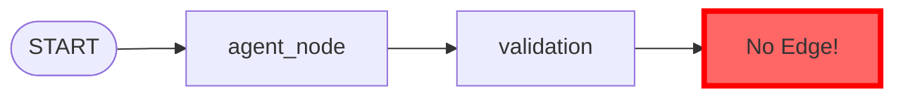
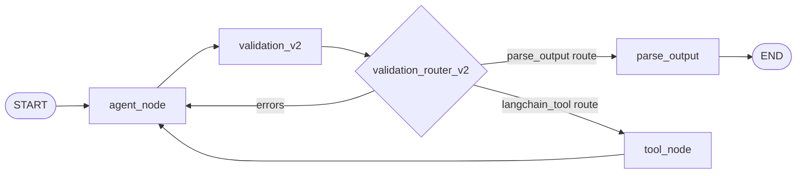
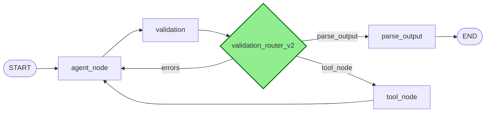

# Validation Routing Graphs - Visual Comparison

## Current SimpleAgent Graph (BROKEN)



### What Happens:

1. Agent generates tool calls
2. Goes to validation node
3. Validation processes and creates ToolMessages
4. **STUCK** - No edges from validation, graph doesn't know where to go
5. LangGraph retries from START
6. Hits recursion limit after 100 attempts

## SimpleAgentV2 Graph (WORKING)



### What Happens:

1. Agent generates tool calls
2. Goes to validation_v2 node
3. Validation processes and adds ToolMessages to state
4. validation_router_v2 function examines tool routes:
   - Structured output (`parse_output` route) → parse_output node
   - Regular tools (`langchain_tool` route) → tool_node
   - Errors → back to agent_node
5. Flow continues properly

## The Fix - Add Conditional Edges



## Tool Route Flow for Plan[Task]

```
1. User Input: "Create a plan"
   ↓
2. Agent generates:
   tool_call = {
     "name": "plan_task_generic",  // Sanitized from Plan[Task]
     "args": {...}
   }
   ↓
3. AugLLMConfig has route:
   "plan_task_generic" → "parse_output"
   ↓
4. Validation node processes tool call
   ↓
5. validation_router_v2 checks route:
   - Sees "parse_output" route
   - Routes to parse_output node
   ↓
6. parse_output node handles structured output
   ↓
7. END
```

## Key Insight

The validation node is just a state updater - it needs a routing function to decide where to go next. SimpleAgent is missing this critical routing step.
